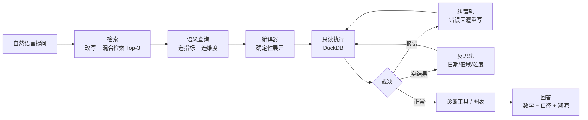

# DSAI · 电商数据分析 Agent

**一句话问数：自然语言 → 语义层 → 确定性 SQL → 口径可解释的洞察与图表。**

电商运营每天都在问「上个月哪个商品卖得最好」「哪些 SKU 该补货」「这笔投放还要不要加」。
本项目把「业务提需求 → 分析师写 SQL → 回解读」的小时级链路，压缩成一次对话——
答案里带着口径、命中的表和可溯源的 SQL，而不是一个不知道从哪来的数字。

---

## 一、我们要解决的问题

Text-to-SQL 在公开基准上已经很能打：Spider-Dev 执行准确率 84.9%，BIRD 71.8%。
但在企业真实数仓里，准确率普遍掉到 **10% ~ 31%**，差距 40~70 个百分点。
掉下来的原因不是模型不够强，而是四类结构性问题——它们也正是本项目的四个模块：

| 痛点 | 现实表现 | DSAI 的做法 |
|---|---|---|
| **指标口径歧义** | 「卖得最好」是销量件数还是净销售额？扣不扣退款？线上退货率约 19.3%，不扣退款会系统性高估近两成 | **语义层**：净销售额、净利润、复购率、ROI 等口径固化为 YAML，LLM 只选指标与维度 |
| **表规模爆炸** | 数百张表，全量 DDL 注入 4.2 万 Token（超预算 2.6 倍），还会干扰模型选表 | **混合检索**：问题改写 + 向量/关键词 RRF 融合，Top-3 表 + 场景卡动态注入 |
| **报错与空结果** | 0 行比报错更危险——用户看到的是一张空表，Agent 会自信地说「没有数据」 | **双轨纠错**：报错走纠错轨（结构化回灌 Error Log），空结果走反思轨（日期边界/值域/粒度/时效），三层熔断兜底 |
| **只出数字不出诊断** | 业务要的是「怎么办」，让 LLM 对着结果即兴发挥既不可控也不可复现 | **诊断工具链**：库存断货/呆滞、营销 ROI 漏斗等经营规则以代码固化，输出 `data / insights / chart` 三件套 |

**效果**（自建评测集：33 问端到端 + 30 问检索集，dev/holdout 拆分防过拟合）：

- 端到端执行准确率：直写 SQL 基线 **20%** → 语义层 + 确定性编译器 **100%**（±1% 容差）
- 检索 Recall@3 **88.9%**，MRR 0.950
- 报错纠错错位处理率 **24/24**，幻觉拦截 17 例（编造订单号/状态/维度不静默通过）

## 二、架构与流程

一次提问的完整旅程：



系统分五层，分层是为了隔离变化：LLM 可换（适配层）、向量库可换（仓储接口）、数仓可换（连接器）。

| 层 | 目录 | 职责 |
|---|---|---|
| L1 数据与元数据 | `data/` | 语义层 YAML（指标口径、关系、维度值域）、表文档与场景卡语料 |
| L2 检索 | `retrieval/` | 问题改写、向量 + 关键词混合检索、Top-3 注入与 Token 预算裁剪 |
| L3 编排 | `orchestration/` | LangGraph 状态机、意图解析、双轨纠错路由、三层熔断 |
| L4 语义编译与执行 | `compile/` | 语义查询 DSL、sqlglot 编译器、干跑校验、只读执行 |
| L5 工具与呈现 | `tools/` | 库存/营销诊断工具、看板与图表；`app.py` 是 Streamlit 前端入口 |

**四条设计原则**：语义先行（LLM 不写 SQL，只写受约束的语义查询）、检索先行（先定位表再生成）、确定性优先（口径、JOIN、诊断规则、图表样式一律用代码固化）、可解释可回溯（每次回答附口径说明、命中表与编译后的 SQL）。

## 三、功能亮点

- 💬 **一句话问数**　自然语言直接问，无需知道表名和字段名；问「上个月哪个商品卖得最好」，回答带口径说明——是按净销售额（已扣退款）排的。
- 📊 **经营看板**　左侧边栏切换进入，三张确定性卡片：**库存告警**（断货/低库存/呆滞分桶 + Top 风险 SKU + DOI×环比象限图）、**经营概览**（当月 7 项指标 + 环比 + GMV 近 6 月趋势 + 各品类分布）、**营销建议**（渠道 ROI 对比 + 最高/最低渠道洞察）。图表支持 ▶ 播放动态回放，数仓指纹变化后自动重建。
- 📈 **一句话生成图表**　在经营看板里直接提问，结果自动配图：标量指标出近 6 期趋势折线，分组结果出分布柱状图，诊断工具出象限散点图——不用手写一行 Plotly。
- 🛠 **出诊断，不只出数字**　`inventory_diagnostic_tool` 给出「A1023 剩余可售 4.2 天、环比 +38%、建议 48 小时内补货」并附依据数字与 DOI 象限散点图；`marketing_roi_funnel_tool` 拆解投放漏斗。
- 🧭 **口径可解释**　每次回答附口径说明、命中的表与编译后的 SQL，可逐步复核 Agent 的每一次决策。
- 🧠 **思考过程可见**　检索、生成、执行各阶段实时推送到思考面板，推理过程流式揭示，跑完自动收起。
- 🌐 **实时问题联网**　天气、汇率、最新资讯这类问题由 LLM 自主决定调用联网搜索，并用带来源摘要的方式回答——不硬塞进数据链路。
- 👋 **闲聊直连**　问候、道谢等零延迟回复；普通闲聊不检索、不动数仓。

## 快速开始

```bash
pip install -r requirements.txt
cp .env.example .env            # 填入 LLM / EMBEDDING 密钥（搜索、Langfuse 可选）

python -m datagen.cli --config datagen/config/scale_small.yaml   # 生成模拟数仓
streamlit run app.py                                             # 启动
```

数仓数据由 `datagen/` 合成生成（规模、脏数据比例、随机种子均在 `datagen/config/` 配置），
规避真实数据的合规风险，同时保留多数据域、多表关联与真实数仓的分布特征。

**技术栈**：LangGraph（有环状态机）· ChromaDB · sqlglot · DuckDB · Pandas / Plotly · Streamlit · Langfuse

---

*本仓库为个人作品集项目：聚焦架构与工程方法，不追求生产级高可用与权限体系。*
